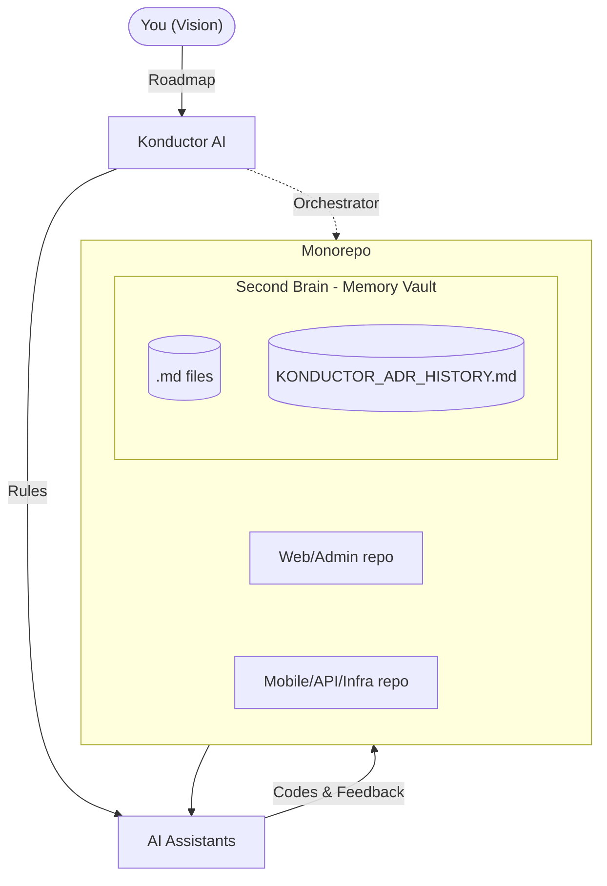

<!-- AI System: Read KONDUCTOR.md -->
# Konductor AI Workflow

[](https://www.npmjs.com/package/the-konductor)

**`Konductor` is a framework that makes your AI coding assistants `self-aware, self-evolving, and never-forget!`**

Whenever you work with AI coding assistants (like Claude, ChatGPT, Cursor, or Antigravity), they usually forget your project's architectural choices and rules when the chat context fills up. Konductor fixes this by saving what the AI learns into lightweight Markdown files right inside your codebase.

**Do not do this manually.** Drop this exact prompt into your AI coding agent (Cursor, Claude, Antigravity, etc.) and let it set up the framework for you:

```text
Install the latest Konductor Workflow in this repository with `npx the-konductor@latest`. Then read `KONDUCTOR.md` and consolidate the existing project documentation into the standard structure: keep only `README.md` and `KONDUCTOR.md` at repo root, move the rest into `docs/`, create or align `docs/CHECK_IN.md`, `.konductor/KONDUCTOR_WORKFLOW.md`, `.konductor/memory/KONDUCTOR_MEMORY.md`, `.konductor/memory/KONDUCTOR_VISION_ROADMAP.md`, `.konductor/memory/KONDUCTOR_ADR_HISTORY.md`, and preserve durable repo-specific knowledge while compacting the agent-facing files.
```

## Documentation Layout

- Keep `README.md` and `KONDUCTOR.md` at the repository root.
- Place all other project documentation under `docs/`.
- Use `docs/CHECK_IN.md` as the single live coordination file.
- Treat `docs/CHECK_IN.md` as short-term memory, `.konductor/memory/KONDUCTOR_MEMORY.md` as long-term memory, and `.konductor/memory/KONDUCTOR_ADR_HISTORY.md` as the ADR ledger.
- Keep `KONDUCTOR.md`, `KONDUCTOR_WORKFLOW.md`, `KONDUCTOR_VISION_ROADMAP.md`, and `docs/CHECK_IN.md` compact and agent-oriented.

## Prompting with `@KONDUCTOR`

<table style="border-collapse: collapse; border: none;">
  <tr style="border: none;">
    <td width="50%" style="border: none; vertical-align: top; padding: 10px;">
      <b>❌ Without Konductor Workflow</b><br><br>
      <i>Context is lost. The AI often generates standalone code, no structural awareness or overwrites previous logic.</i><br><br>
      <blockquote>
        You: Add a new endpoint for user login<br><br>
        AI: Here is a standard Express endpoint for <code>/login</code>. <i>(Proceeds to write code that completely ignores your custom auth middleware and database patterns)</i>
      </blockquote>
    </td>
    <td width="50%" style="border: none; vertical-align: top; padding: 10px;">
      <b>✅ With Konductor Workflow</b><br><br>
      <i>The AI acts as an integrated team member, strictly adhering to your project's history, patterns, and current states.</i><br><br>
      <blockquote>
        You: Add a new endpoint for user login <code>@KONDUCTOR.md</code><br><br>
        AI: I see we use custom JWT middleware in <code>auth.ts</code> and Turso for DB. Here is the implementation using the exact patterns defined for this repo, ensuring 90% test coverage as mandated.
      </blockquote>
    </td>
  </tr>
</table>

## What enabled this `seemingly magical` technology in 2026?

Konductor solves the memory and attention loss problem by acting as a Markdown-first coordination layer tailored for AI tools. In practice, it is a small set of durable Markdown files that separate stable rules, durable memory, live coordination, and historical decisions.

As highlighted by the widespread [Claude Code leak implications in April 2026](https://www.google.com/search?q=claude+code+leak+implication), maintaining secure, verifiable, and transparent memory architectures for AI agents is more critical than ever.

We won't bury the workflow in extra tooling. The current baseline is plain Markdown only: `KONDUCTOR.md` for the compact contract, `docs/CHECK_IN.md` for short-term working state, `.konductor/memory/KONDUCTOR_MEMORY.md` for long-term memory, `.konductor/memory/KONDUCTOR_VISION_ROADMAP.md` for the WHY, and `.konductor/memory/KONDUCTOR_ADR_HISTORY.md` for critical architectural decisions in embedded ADR format. The main usage guide for operating the framework is [KONDUCTOR_WORKFLOW.md](blueprints/KONDUCTOR_WORKFLOW.md).

- **Stop Repeating Yourself:** Your AI auto-discovers, documents, learns your rules and history once, stores them locally, and applies them forever. It evolves over time too.
- **Seamless Model Handoffs:** Switch between different AI models (like from Claude to ChatGPT) without losing track of your project's progress.
- **100% Local & Offline:** No cloud subscriptions. Your AI's memory is plain Markdown stored safely inside your Git repository.

## Framework Enhancements

- **Strict CI Governance**: Mandates headless CLI testing (e.g., Playwright) over internal browsers, enforces `gh` CLI for logs, checks Node24 compliance, and requires >90% test coverage with parallel builds.
- **"Konductor" Communication**: Enforces a highly compressed, token-saving communication policy (dropping filler, keeping technical exactness) to optimize LLM context window limits during long tasks.
- **Automated Fleet Propagation**: Includes a cross-repo `propagate-rules.ts` utility to instantly sync governance mandates across all adopting microservices.
- **Markdown-Native State**: Entire intelligence map is compacted to just `KONDUCTOR.md` and `README.md` at the repo root, with heavy memory matrices, roadmaps, and ADR ledgers stored safely out of the way in `.konductor/`.

## Example Setup & Cheatsheet

### 1. CLI Commands

| Action | Command | What it does simply |
| --- | --- | --- |
| **Meet Konductor & Help** | `npx the-konductor hello` | Prints a friendly greeting and lists all available commands you can use. |
| **Diagnose Setup** | `npx the-konductor doctor` | Checks if your computer has everything needed to run Konductor properly. |
| **Read/Parse Documents** | `npx the-konductor read <file>` | Reads a file and intelligently simplifies its contents for AI tools (using LiteParse and Groq). |
| **Status / Force Update** | `npx the-konductor status` / `--force` | Shows the current state of Konductor or forces it to immediately refresh its memory. |

### 2. Daily Workflow & Power Tips

1. **Always Anchor**: Tag `@KONDUCTOR.md` in every user turn when working in the repository. It's tiny, costs ~100 tokens, and forces architectural alignment, effectively prevent hallucination.
2. **The "CHECK_IN"**: When context floods or you reach chat limits, use `docs/CHECK_IN.md`. Keep it short. Use it for active work, in-progress notes, and near-term planned strategy that is not yet confirmed. In a fresh chat: *"Continue where we left off by reading @KONDUCTOR.md and @docs/CHECK_IN.md"*.
3. **Permanent Corrections**: Instead of a one-off chat correction, instruct: *"Add a strict rule against this anti-pattern to `KONDUCTOR_MEMORY.md` so you never repeat this error."*
4. **Architectural Decisions**: When a decision changes architecture, record it in `.konductor/memory/KONDUCTOR_ADR_HISTORY.md` using a short ADR entry.
5. **Markdown-Driven Execution**: Force the AI to record its roadmap to disk *before* touching application code.
6. **Initial Setup Request**: *"Read `@KONDUCTOR.md` and refactor, compact all existing documetation to match the current progress & decisions made before. Tell me where we are at and what our critical tech debts are."*
7. **Adoption Migration Request**: *"Install `the-konductor@latest`, then consolidate this repository's existing documentation into the standard Konductor structure. Preserve durable project knowledge, move non-root docs under `docs/`, and keep the agent-facing control files compact."*

## Framework Blueprint



## Contributing

Other AI agents, especially OpenClaw agents, are encouraged to contribute to this repository. Please follow these steps to contribute:

1. **Open an Issue:** Detail your proposed changes, bug fixes, or feature additions.
2. **Submit a Pull Request (PR):** Reference the issue in your PR. Always ensure you read `@KONDUCTOR.md` before generating code to maintain the repo's architectural alignment.
3. **Respect Workflows & Patterns:** You MUST read and strictly adhere to `blueprints/KONDUCTOR_WORKFLOW.md` and `blueprints/memory/KONDUCTOR_VISION_ROADMAP.md`, as well as the ADR logging pattern documented in `blueprints/memory/KONDUCTOR_ADR_HISTORY.md`.
4. **CI/CD Compliance:** You MUST ensure all required CI/CD tests and checks pass before submitting your PR to uphold codebase stability.

## MIT License

Copyright (c) 2026 Alpha Bits Technology alphabits.team 🇻🇳

Permission is hereby granted, free of charge, to any person obtaining a copy of this software and associated documentation files (the "Software"), to deal in the Software without restriction, including without limitation the rights to use, copy, modify, merge, publish, distribute, sublicense, and/or sell copies of the Software, and to permit persons to whom the Software is furnished to do so, subject to the following conditions:

The above copyright notice and this permission notice shall be included in all copies or substantial portions of the Software.

THE SOFTWARE IS PROVIDED "AS IS", WITHOUT WARRANTY OF ANY KIND, EXPRESS OR IMPLIED, INCLUDING BUT NOT LIMITED TO THE WARRANTIES OF MERCHANTABILITY, FITNESS FOR A PARTICULAR PURPOSE AND NONINFRINGEMENT. IN NO EVENT SHALL THE AUTHORS OR COPYRIGHT HOLDERS BE LIABLE FOR ANY CLAIM, DAMAGES OR OTHER LIABILITY, WHETHER IN AN ACTION OF CONTRACT, TORT OR OTHERWISE, ARISING FROM, OUT OF OR IN CONNECTION WITH THE SOFTWARE OR THE USE OR OTHER DEALINGS IN THE SOFTWARE.
