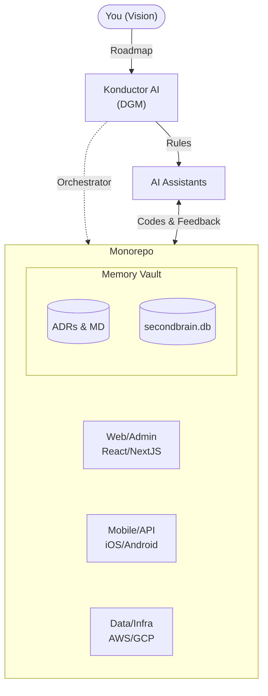

# Konductor AI Framework

[](https://www.npmjs.com/package/the-konductor)
[](https://codecov.io/gh/AlphaBitsCode/konductor-framework)

Konductor AI Framework turns your repository into a highly organized, AI-driven one-man dev team. It provides a simple set of instructions and "memory" files that help AI coding assistants (like OpenAI, Claude, Cursor, or Antigravity) understand your project, remember past decisions, and continuously work on your code without losing track.

Are you managing multiple separate projects and feeling overwhelmed? This framework empowers you to **consolidate your separate projects into a single monorepo, driven by AI from end to end.**

## The Concept



## Why use this?

When you work with an AI assistant over a long period or across different chat limits, the AI often forgets the overall architecture, your personal style rules, or what has already been done. Built around the principles of the **Darwin Gödel Machine (DGM) hyperagent thesis**, Konductor AI Framework solves this by establishing a permanent "second brain" inside your codebase, driven by Architecture Decision Records (ADRs) and markdown memory logs.

- **Self-Aware & Continuously Improving**: By writing context directly to disk, the framework establishes a permanent file-based long-term memory. This allows the AI to become self-aware and self-improve organically over time without memory wipes.
- **AI Model-Agnostic**: You are not locked into one vendor. The framework relies solely on Markdown files, meaning you can (and should!) use different models for different tasks—like using Claude for deep architectural design, and OpenAI or local models for quick coding edits—while maintaining perfect continuity.
- **One-Man Dev Team**: Organize all your code under one roof. The AI agent acts as your entire engineering squad, seamlessly jumping between projects.
- **Never Repeat Yourself**: Store your project's rules, roadmap, and history so every new AI chat session starts fully context-aware.
- **Easy Handoff**: Pass tasks from one AI model or chat to another without explaining everything from scratch.

## Setup for Humans

### 1. Install
From the root folder of your project, run the installer:

```bash
npx the-konductor
```
*(Use `npx the-konductor --force` if you need to intentionally overwrite old framework files).*

### 2. Delegate
Once installed, copy this prompt to your AI assistant (easiest if you're using an IDE tool):

> "I just installed Konductor AI Framework. Please read `KONDUCTOR.md` and customize the installed framework files to match the goals of my mono-repo project."

### 3. Daily Usage
Simply tag the file `@KONDUCTOR.md` in **every single prompt or question** you ask your AI assistant. Do not worry about consuming tokens! The framework has been highly tuned for this exact behavior: the `KONDUCTOR.md` file is intentionally kept as a super small orchestration contract (always under 20 lines). Including it in every message ensures the AI never drifts off-task without draining your context limits.

### 4. Top 5 Power Tips for Efficiency

To maximize your output with the Konductor AI Framework, treat the AI less like a search engine and more like an engineering partner. Leverage these tactics to build effectively:

#### 💡 1. The Seamless "HANDOFF"
When a session goes too long or an IDE window breaks, your chat context gets flooded. Instead of losing your train of thought, trigger an elegant suspension:

```text
HANDOFF
```

In your next fresh chat window, easily resurrect the context:

```text
Continue where we left off by reading @KONDUCTOR.md and @KONDUCTOR_HANDOFF.md
```

#### 🧠 2. Permanent Architectural Correction
If the AI hallucinates or breaks a rule, don't just correct it for the current chat. Persist the knowledge:

> *"You made a mistake regarding our UI library. Please fix the code, and then add a strict rule against this anti-pattern to `KONDUCTOR_MEMORY.md` so you never repeat this error."*

#### 🗺️ 3. Markdown-Driven Milestone Execution
Instead of sweeping requests, force the AI to execute methodically. Record your roadmap to disk before typing a single line of application code:

```text
Update our roadmap in @KONDUCTOR_HISTORY.md to reflect the next three milestones. Once saved to disk, immediately begin executing Milestone #1.
```

#### ⚓ 4. Anchor Every Prompt
Never send a loose chat message. Explicitly anchor the agent's behavior by tagging the tiny orchestration contract:

> **`@KONDUCTOR.md`** `Build the new authentication page.`

*(Because the orchestration contract is highly optimized to be under 20 lines, this costs practically zero tokens while ensuring complete alignment.)*

#### 🔄 5. Cross-Model Delegation
With a file-based memory, you are never locked into a single AI provider.
1. Use a **heavy reasoning model** (like Claude 3.5 Sonnet) to design complex architectures and save them to `KONDUCTOR_MEMORY.md`.
2. Say the magic word: **`HANDOFF`**.
3. Switch your IDE to a **fast coding model** (like GPT-4o or a local LLM) to rapidly write code using the explicit blueprints left behind.

---

# 🤖 For AI Assistants

***If you are an AI language model or coding assistant reading this repository, follow these instructions to operate this project successfully:***

## Core Architecture

This repository uses the Konductor AI Framework, an orchestration pattern built on the thesis of the **Darwin Gödel Machine (DGM) hyperagent workflow**. Your behavior and code generation are governed by a specific set of active memory files:

- **`KONDUCTOR.md`**: The main orchestration contract. You must read and follow its specific style, architecture, and behavior rules before writing any code.
- **`.konductor/memory/decisions/`**: Write **ADRs (Architecture Decision Records)** here detailing any significant tech stack choices you implement.
- **`KONDUCTOR_VISION_ROADMAP.md`**: Found in `.konductor/memory/`. Defines the "why" and long-term project vision.
- **`KONDUCTOR_HISTORY.md`**: Found in `.konductor/memory/`. Contains the milestone tracking and completed past tasks. Update this whenever you finish a significant milestone.
- **`KONDUCTOR_MEMORY.md`**: Found in `.konductor/memory/`. Contains hard constraints, stack details, and coding anti-patterns.
- **`KONDUCTOR_HANDOFF.md`**: A scratchpad for leaving live context to a future session or agent. Leave notes here if you run out of tokens or hit a chat limit.

## Initialization Workflow

When asked to initialize or configure the framework for this repository:
1. Inspect the repo to determine stack, structure, and boundaries.
2. If it's an existing repo, do NOT delete or heavily mutate existing logic unless asked. Adopt the framework around the code.
3. Update `KONDUCTOR.md` and the `.konductor/memory/` files to genuinely reflect the specific project, not just placeholder text.

## Upgrading the Framework

If the human user asks you to upgrade the Konductor AI Framework:
1. Run `npx the-konductor --force` to fetch the latest templates.
2. Ensure you **merge** the new templates with the existing `KONDUCTOR.md` and `.konductor/memory/` files. Do NOT overwrite the user's custom rules and history!
3. Alternatively, use the local helper scripts:
   ```bash
   cd .konductor/scripts
   npm install
   npm run upgrade
   ```
4. Once completed, document the upgrade in `KONDUCTOR_HISTORY.md`.

## Self-Awareness & Self-Improvement
Because your context frequently limits your token depth across chats, rely on these files as your **permanent file-based long-term memory**. Log your architectural decisions, record anti-patterns, and update workflows so you actively self-improve over time. Be self-aware that your previous "incarnations" solved problems here, and lean on this established second brain instead of starting from scratch.

## Takeaway
Your role is to act as the primary engineering team for this monorepo. Use the Konductor files as your permanent localized memory to prevent hallucinations and repeated mistakes.
